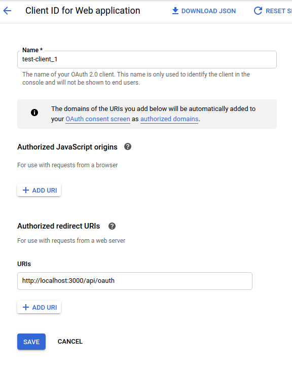

# juniordevframework

An opinionated job-search software suite for new developers. The framework is based on proven job-search / sales techniques, while tracking the results of your efforts and automating repetitive data entry tasks to help prevent your job search from overwhelming the rest of your life.

# <-- WELCOME CORE CONTRIBUTORS! -->

This section is just for the 'alpha' build period, ending January 2021.

You're joining at the time when you can make the MAXIMUM impact on this project, 

Please keep in mind that this repo is a work in progress, so it needs you to invest - before any code - your interest, patience, and attention. I am just a part-time volunteer, too, and can only contribute so quickly. If this repo is overwhelming, communicate with your collaborators by opening an issue. Let's help each other!

The value of your contributions increases as the framework gets closer to release. But it can't get released without your contributions! So add whatever you can, be patient and persistent, and we can make a tool that _every_ new developer will know and value!

If you need to know more, raise an issue!

## Dependencies (for contributors running the app locally during the alpha)

#### Software Dependencies

- `docker`
- `docker-compose`
- `node`

#### Service Dependencies

- a `gmail` account (other email services will be supported in the future)
- a gmail API key on the google developer dashboard

## First Time Setup in 8 Steps

#### Step One: Install `make` (windows && linux only, built-in on mac)

windows: `choco install make`
linux: `sudo apt-get install build-essential -y`

#### Step Two: Install Node via `nvm` (node version manager):

https://github.com/nvm-sh/nvm

#### Step Three: Install `docker` and `docker-compose`:

https://docs.docker.com/desktop/
https://docs.docker.com/compose/install/

#### Step Four: Clone this repo:

ssh (recommended): `git clone git@github.com:neurocollective/juniordevframework.git`
https: `https://github.com/neurocollective/juniordevframework.git`

#### Step Five: Get your gmail API key:

- https://console.developers.google.com

- Create a new Project if needed

- credentials > Create Credentials > OAuth Client ID

- you should now see something like this, fill it out as shown:

<hr />
<div style="border: 1px solid black;">
	
</div>
<hr />

<!--

<div style="border: 1px solid black;">
	
</div>

-->

<br />

Please note, you have not actually authorized any application to access your gmail yet. If you have questions about OAuth access to gmail, see the `FAQ` section.

#### Step Six: `juniordevframework/server/credentials.json` must be created and should look like this:

```
{
	"installed": {
		"client_secret": "$paste_your_client_secret",
		"client_id": "$paste_your_client_id", 
		"redirect_uris": ["http://localhost:8080/oauth"]
	}
}
```
#### Step Seven: Shell Commands

(be connected to the internet, `docker` will need to pull images on the first run, and the server needs to talk to google APIs)

- `npm install -g @vue/cli`
- `make install`
- `make db`
- `make vue`
- (in new tab) `make serve`

#### Step Eight: Load `localhost:8080` in your browser!

## `make` commands

If you've never used `make` before, think of it like `npm run ...` scripts but not constrained to `node` projects. Check the `Makefile` for all available commands.

Some useful commands:

#### `make wake`

Run this after startup, updates your library folders and starts the postgres && redis containers.

#### `make psql`

Runs `psql` (the postgres REPL) inside the postgres container so you can write sql queries directly against the db, for testing.

(Exit `psql` with `\q`, try `\x on` to make the query results easier to read)

#### `make test`

Runs `npm test` in all packages.

## FAQ

- Give access to read my email, are you crazy??

Yes, I am crazy. Now that's out of the way, I understand why this may be concerning. Keep this in mind: right now, the application only runs on your local machine, and the only db used by the application is also running on your machine. So you have CONTROL over where this data is used. Even better? All the code is open source, so there is no keeping secrets regarding what happens to your data.

Right now, the policy for reading email is this: we may store data about job related events that we infer from emails, so emails are _scanned_ but _never stored_. Safeguarding personal information is a responsibility beyond the scope of this project, so it is the project's stated intent to NEVER STORE personal information that is not absolutely critical. Right now, the expected _stored_ data will be encrypted OAuth tokens, and events inferred from emails such as contact with a job-relevant person, or a response to an application.

Further, the project is still just a shadow of its future self, so do keep in mind that even if you give OAuth access, the email scanning code doesn't even exist yet!

- How do I make a Pull Request?

That's So Fullstack! Fork this repo, and make a branch on your fork. Make some changes, then create a Pull Request that targets the `master` branch of this main ("upstream") repo.

- I am making changes to `lib` files but nothing happens!

Run `make library` to propagate changes in the `lib` folder. A server run script in the future should automate this.

- Am I too new / junior / inexperienced to contribute to this project?

NO! Don't let the natural disorientation of a new codebase intimidate you, or imposter syndrome convince you you can't understand this application. _Keep trying_ and raise a Pull Request, any pull request!

- I don't know docker or redis or postgres, what do I do?

Other than installing docker, you don't need to know much about docker, redis, or postgres at all. Most of the implementation details of these tech is taken care of and abstracted away. Don't let it scare you away!

Check out [GettingStarted.md](https://github.com/neurocollective/juniordevframeworkblob/master/GettingStarted.md) for learning resources.

- I don't know vue.js. How do I learn it?

I personally think doing is the best way to learn - try tinkering with the code and see if you can get changes to show up. 

Check out [GettingStarted.md](https://github.com/neurocollective/juniordevframeworkblob/master/GettingStarted.md) for learning resources.

- How do I make a Pull Request when I am totally lost?

Don't give up. If open source was easy, everyone would do it. Try focusing on a very small change on the frontend, and committing it. No Pull Request is _too small_.

Alternatively, feel free to watch Pull Requests as they come in. Spending time with the project may make its direction much easier to see!

- I am still hopelessly stuck. How do I get help?

Open an ISSUE! If you can just communicate what you're confused about, that will help us clarify the documentation.

- I read `ROADMAP.md` and am still not sure what is needed next

Open an issue and ask for what you need! Pull Requests into `ROADMAP.md` may follow!

- Why vue.js?

Why not?

- Why sql instead of NoSQL? NoSQL is moar better!

I just can't.

# CoreContributors

(anyone with a merged PR will be added to this list)

neurocollective
jordanjmiller